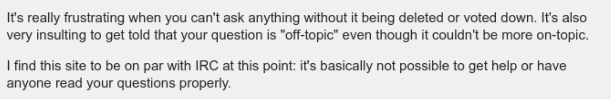

# Why-will-My-Question-Be-Closed

NLP-Based Pre-Submission Predictions of Question Closing Reasons on Stack Overflow.

Click [here](https://github.com/Kadam-Tushar/Why-Will-My-Question-Be-Closed/blob/main/Report/TSE_Final_Report.pdf) to see detailed project report and evaluations. 

   

**Stack Overflow** is a popular Community-based Question Answer website focused on software programming and has attracted more and more users in recent years. As of October 2021, Stack Over- flow had more than 22 million questions. Although the posting ethics were guided in detail, the quality of many posted questions is poor. A question on SO is closed if it doesn’t follow guide- lines from SO. But often reason for closing particular question is blurred to user, which leads to debates and occasional negative behavior in answers or comments.

Hence we can see [such](https://meta.stackoverflow.com/questions/388076/is-this-how-we-want-to-treat-newcomers) comments :confused:

### About this work: 
- Implemented a practical tool capable of **pre-evaluating** the questions to be posted on SO, and determining whether the question will be marked for closure by the community **after submission**.
- Classifier models for binary classification of whether question will be closed in futre and classfiying exact reason for closing a question. 

### Contributions of this work: 
- Classifiers relying exclusively on the textual properties of a question: its title, body without using any post-submission information, such as number of answers, scores, or user reputation.
- Predicting the exact closing reason of a question. 
- 5% increase in accuracy of binary classification (Open/Closed questions) and 10% increase in accuracy of  multi-class classification problem (Reason for closing question) over performances mentioned in paper. 

## Acknowledgements

 - [Original Paper](https://ieeexplore.ieee.org/document/9397539) : (ICSE 21)  This work is pytorch implementation of paper. Over this model I have applied more techniques to improve the overall performance of model. 

## Authors

- [@Kadam-Tushar](https://github.com/Kadam-Tushar)

  

  
## Contributing

Contributions are always welcome!

## Dataset: 
The dataset used is Stackoverflow data dump till Sept 2021, removed questions posted before June 2013 because after that current question closing policy was introduced. Questions closed due to duplication were also excluded from this dataset because of two reasons: i) this problem has already been well examined previously and ii) finding a duplicate would imply the knowledge of the previously posted questions, which is the opposite of the purpose of using only pre-submission information.

Stackoverflow has humongous dataset - 5.5 crore posts. There are around 1 million closed posts. In compressed format its around 30GB and expands to 401 GB SQL server database.

One can download dataset from [here](https://archive.org/details/stackexchange).

## Repository structure: 

- `notebooks` folder contains EDA steps and sampling SO posts from huge dataset. 
- `python_scripts` folder contains all model training, evalutation, visualization scripts.
- `stackexchangeparser` submodule contains code for parsing stackoverflow posts which are in XML format to convert them into csv formats. 
- `Dataset` folder in gitignore for storing all the dataset files. 
- Insider `python_scripts` there is folder `models` which contains all code for models I tried. 
- All the configuration of models are written in `modules.py` which is acting as configs file for model. 
- Order of execution of scripts is as follows: 

  1. Use `csv2tensors.py` to convert csv files of SO post into tensors representations (tokenized) of Stack overflow posts for models.
  2. Use `train.py`  for training of models using tensors obtained in previous step. 
  3. Use `evaluate.py` for doing inference on trained models using test set. 
  4. Use `metrics.py` for getting all evaluation metrics of particular model.
  5. Use `visualise.py` for getting visualisations like `confusion matrix` of classification models.
  6. Use `tsne_pca.py` to getting  2 - Dimensional t-SNE embeddings and PCA transfomrations visualizations. 
  7. In `classical_ml.py` I have tried to apply classical ML models like KNN, Logistics regression, SVC on embeddings obtained from previous deep learning models to exploit semantic meanings of those embeddings. 
  (Note: You need to set up Rapids.ai env for running this file. As explained [here](https://rapids.ai/start.html#get-rapids).

## License

[MIT](https://choosealicense.com/licenses/mit/)

  
